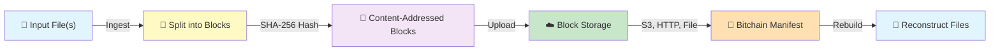

# bitchain

A lightweight **virtual filesystem** that uses the internet as block storage.

`bitchain` is a Rust CLI for managing content-addressed binary chains.
It breaks files into immutable SHA-256 blocks, distributes them across HTTP, HTTPS, S3, or local storage, and reconstructs them on demand.
Perfect for versioning large files, distributing datasets, or building decentralized storage systems.

## Features

- Ingest a single file or directory into a JSON-based bitchain manifest
- Support local file URIs, HTTP(S) URIs, and S3 block URIs
- Upload blocks to S3 when `--uri-base` uses `s3://`
- Dry-run ingesting without writing data
- Rebuild files from a bitchain manifest
- Validate bitchain JSON structure
- Backwards-compatible old-style bitchain format support

## How It Works



Each file is split into fixed-size blocks (default 1MB), hashed with SHA-256, and stored at URIs.
The bitchain manifest records file paths and block URIs, enabling lossless reconstruction from any available block source.

## Install

Build from source:

```bash
cargo build --release
```

Run from the workspace:

```bash
cargo run -- <command>
```

## Development

Use the included Makefile for common tasks:

```bash
make build    # Compile the project
make test     # Run tests
make lint     # Format and lint
make fmt      # Format code
make check    # Run cargo check
make all      # build + lint + test
make run      # Run with arguments
```

## Configuration

Create or update the config file with:

```bash
cargo run -- --setup-config
```

This writes JSON to `~/.bitchain/config`.
If you choose AWS credentials, the CLI will prompt for:

- AWS Access Key ID
- AWS Secret Access Key
- AWS Region
- optional AWS Session Token

## Commands

### `ingest`

Ingest a file or directory and create a bitchain manifest.

```bash
cargo run -- ingest --input path/to/file.iso --uri-base s3://bucket/prefix --output file.bitchain.json
```

For directory ingestion:

```bash
cargo run -- ingest --input ./data --uri-base s3://bucket/prefix --output data.bitchain.json
```

If `--uri-base` is not provided, ingest writes blocks locally and uses `file://` URIs.

Optional flags:

- `--output-dir <dir>`: local directory for block files when `--uri-base` is not set
- `--block-size <bytes>`: bytes per block (default `1048576`)
- `--dry-run`: simulate ingest without writing files or uploading

### `rebuild`

Rebuild files from an existing bitchain JSON manifest.

```bash
cargo run -- rebuild --bitchain file.bitchain.json --output-dir restored
```

This reconstructs each `files[].path` entry under the output directory.
It tries each block URI in order and uses the first successful download.

### `show`

Print a bitchain manifest to stdout.

```bash
cargo run -- show file.bitchain.json
```

### `validate`

Validate the manifest structure.

```bash
cargo run -- validate file.bitchain.json
```

### `Help`

Print CLI help:

```bash
cargo run -- help
```

## JSON Format

Bitchain manifests use the following JSON schema:

```json
{
  "version": "1.0",
  "files": [
    {
      "path": "relative/path/to/file.txt",
      "blocks": [
        {
          "hash": "<sha256-hash-of-block>",
          "uris": [
            "s3://bucket/prefix/relative/path/to/file.txt/<hash>",
            "https://example.com/blocks/<hash>.bin"
          ]
        }
      ]
    }
  ]
}
```

### Field definitions

- `version`: manifest version string
- `files`: array of file entries
- `files[].path`: original file path preserved from ingest
- `files[].blocks`: ordered block list for the file
- `blocks[].hash`: SHA-256 hash of block bytes
- `blocks[].uris`: candidate URIs for the block

### JSON Schema

For formal validation, see [bitchain-schema.json](bitchain-schema.json).
The schema uses JSON Schema draft-07 and validates both the modern multi-file format and legacy single-file format.

### Old-format compatibility

`bitchain` also accepts legacy manifests with top-level `version` and `blocks`:

```json
{
  "version": "1.0",
  "blocks": [
    {
      "hash": "<sha256-hash>",
      "uris": ["file:///tmp/<hash>.bin"]
    }
  ]
}
```

This format is mapped to a single generated `files[0]` entry when rebuilt.

## Examples

Run a dry-run of a directory ingest:

```bash
cargo run -- ingest --input ./docs --uri-base s3://alpha.softsurve.com --dry-run
```

Ingest a file locally and produce a manifest:

```bash
cargo run -- ingest --input ./image.iso --output-dir ./blocks --output image.bitchain.json
```

Rebuild from a manifest:

```bash
cargo run -- rebuild --bitchain image.bitchain.json --output-dir ./restored
```

Validate a manifest:

```bash
cargo run -- validate image.bitchain.json
```
